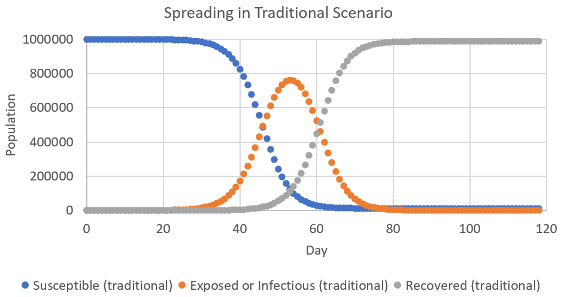
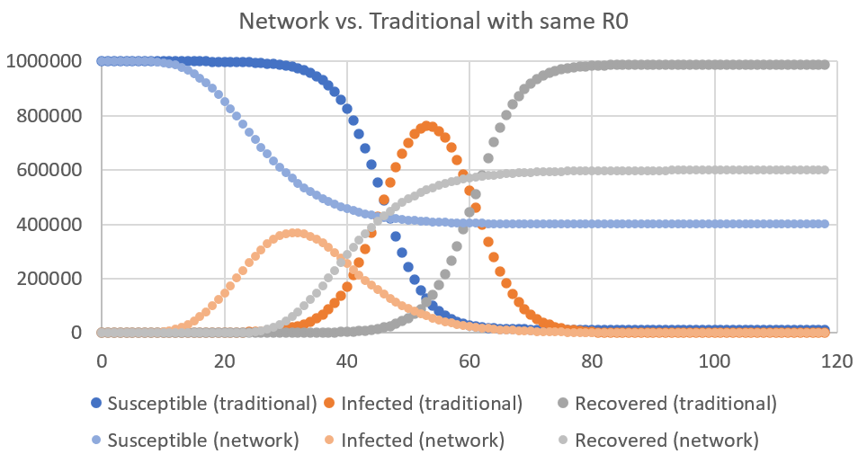
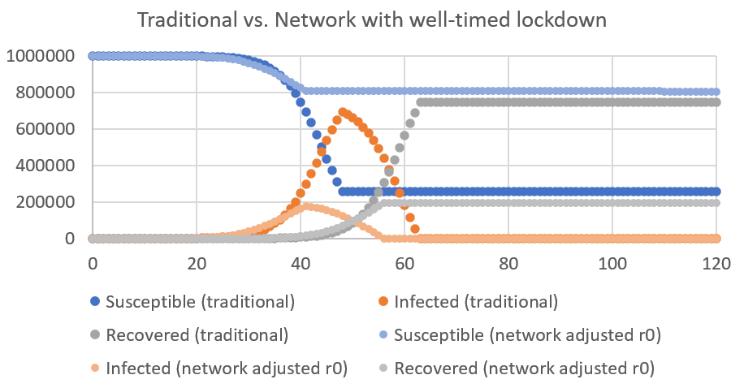

# Corona Model with a Varying Infection Rate

Author: Luzius Meisser, [luzius.meisser@uzh.ch](mailto:luzius@meissereconomics.com)

# Summary

The usual pandemic models assume the infection rate to be the same for all citizens (for example [covidsim.eu](http://covidsim.eu) or the  [Robert Koch Institute Model](https://www.rki.de/DE/Content/InfAZ/N/Neuartiges_Coronavirus/Modellierung_Deutschland.pdf?__blob=publicationFile)). However, in reality, social interactions follow a power-law distribution: some people are much better connected than others and also have much more potentially contagious social interactions with a more diverse set of others. Assuming the power-law distribution usually observed in social networks, there should be a few super-spreaders with a very high infection rate (e.g. a politician who shakes hands all day), and many less connected citizens with a low infection rate (e.g. a gamer :) ). Naturally, the super-spreaders are not only the ones who spread the disease the most, but also the ones that will get it first. As a consequence, the infection rate R0 will look very high in the initial phase of a pandemic, but decline sharply once the super-spreaders are cured (or dead). A further consequence is that herd immunity is reached much faster and that a well-timed lockdown can stop the disease much earlier than what other models suggest.

# Update 2020-05-02

I got a nice email from a reader pointing out two problems with the March version of this model: I got the power-law distribution wrong and the code I uploaded did not take into account that super-spreaders are more likely to get infected. While I fixed the latter issue early on and updated the graphs, I forgot to synchronize the code. In the meantime, I also fixed the first issue and am now using a proper powerlaw distribution (I hope :) ). What you see here is the updated version. A snapshot of the old version can still be found [here](https://github.com/meisserecon/corona/blob/9903dd3f657dd7cd1eb8110d1040c2c276c75c1e/readme.md). Comparing the two models, the hands-off scenario without lockdown has fewer eventual infections (53% of the population instead of 70%) and the well-timed lockdown scenario still leads to about 20% of the population getting eventUally infected.

In the meantime, this simulation also got some attention on [Marginal Revolution](https://marginalrevolution.com/marginalrevolution/2020/04/epidemiology-and-selection-problems.html), which later also discussed a [very interesting paper with a similar approach](
https://marginalrevolution.com/marginalrevolution/2020/04/modeling-covid-19-on-a-network-super-spreaders-testing-and-containment.html). In that paper, Reich, Shalev and Kalvari create a model with an actual network (mine is taking a shortcut here and does not feature persistent nerwork connections). They also find that the effective infection rate starts higher and falls faster than in a traditional model. While they simulate various measures, they do not include a temporary lockdown scenario. They also point out that in a network model, an R below 1.0 is no guarantee that no more outbreaks will happen, which lead me to remove claims about when "herd immunity" is reached.

# Base Model

First, I started with a simple model to verify what I know - and it turned out that I did not even fully understand the usual model very well up to now. When thinking about herd immunity, I assumed that once it is reached, the pandemic is over. For example, if R0=3.0, then 66% of the population need to gain immunity in order to read herd immunity. However, herd immunity only means that exponential growth has been stopped and in fact many more people will be infected until the pandemic stops completely. This is shown in the following chart:

Having set an R0 = 3.0, herd immunity is reached around day 50, when 66% of the population is infected or cured. However, almost everyone will get infected eventually because there are still so many infectious hosts around. Only 1% of the population will never get the virus in this case.

The other parameters of the model are: a population of 1 million, an incubation period of 5 days (time from infection to becoming infectious) and a recovery period of 10 days. In my case, R0=3.0 means that every infected person will get in contact with 3 other persons at average during the 10 days that person is infectious. All of this is done in a probabilistic simulation with each host being simulated as an individual agent.

Of course, you can always tweak this model, but you will always come to a very dire prediction about the outcome: even if we stop the virus with drastic measures, it will probably just come back once we relax the measures again. Unless we find a cure or keep the drastic measures in place for a long, long time, the large majority of the population will sooner or later contract the virus.

# Allowing Variation in the Infection Rate

All of this looks much better with a small adjustment to make it more realistic. In reality, not everyone spreads the virus equally fast. Some people stay at home all day while others permanently meet people and shake hands. Usually, social networks follow some kind of powerlaw distribution: some people have lots of contacts, and most people have fewer than average contacts. In my simulation, I use a [Pareto Distribution](https://en.wikipedia.org/wiki/Pareto_distribution) with xmin=1.0 and alpha set such that the expected value corresponds the infection rate R0. This leads to having a minority of super-spreaders who are very social and have lots of contacts with others. These super-spreaders will spread the virus very fast, but also most likely be among the first to get it. Simulating this with the same R0=3.0, we get a different picture than before (the lighter colors are the new data with the implicit power-law network):

In comparison to the base simulation, we can observe that the number of infected goes up more steeply, but peaks at a lower level. Also, not everyone will get infected anymore. About 40% of the population is spared from the virus. The spared ones are mainly those who do not have much social interaction.

# Calibrating the Model

Since the new model climbs up way too fast in the beginning, it makes sense to adjust R0 in order to fit the curve of the base model. When choosing R0=2.35, the network-based model reaches the same number of infected after 40 days. This is kind of an arbitrary choice as the curves have different shapes.

The nice effect of that is that the number of eventually infected is again somewhat lower, namely 53% instead of 60%.

# Well-timed Lockdown
The biggest and nicest news is yet to come: In the traditional model, herd immunity is reached when 66% are infected (with R0=3.0). However, in the powerlaw model, herd immunity is already achieved much earlier and a well-timed lockdown leads to only 20% of the population getting eventually effected.

The following chart compares a well-timed lockdown in the traditional model with a well-timed lockdown in the super-spreader model.

In the traditional model, reaching herd immunity takes quite long. With R0=3.0, one has to wait until 66% of the population is infected (here, I wait a little longer to be on the safe side). A well-timed lockdown at that moment prevents up to 33% of the population from getting sick.

In the model with heterogeneous contagion, herd immunity is reached earlier and a well-timed lockdown prevents much more cases. In the end, only about 20% of the population is infected.

To test whether herd immunity has actually been reached, I adjusted the model such that every day, one random citizen is infected. Here, the random nature of our model can bite us again. It is perfectly possible for the population to have reached herd immunity overall (i.e. an infection rate below 1.0), but having many subsets of the population whose average infection rate is still above 1.0. If such a subset happens to get infected, there will be another (local) outbreak.

# Conclusion

Taking into account that not every host has the same infection rate (i.e. allowing for heterogeneous R0) makes a huge difference and I am much more hopeful again that this crisis will be over again sometime this summer. After that, we might still see sporadic local outbreaks, but the pandemic should be over.

All of this should not be misunderstood as a justification to be less careful. Also in the network scenario, about 25% of the population is sick at one point in time around, overwhelming the health system if not accompanied by ancilliary measures. However, one should note that everything will play out slower in a larger population, when simulating a real network with stable connections, or when the curve is flattened thanks to the well-known counter-measures. Nonetheless, this model can provide some hope for those who just read the usual extremely pessimistic forecasts and it can help in explaining why the infection rate seems to go down over time at a faster rate than the traditional model predicts.

All in all, the key take-away is: taking into account that people are different, the pandemic will be a less dramatic than traditional models suggest, in particular when combined with a well-timed lockdown.
