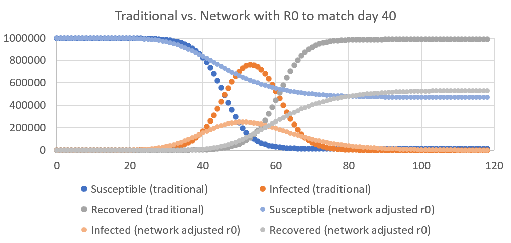

# Corona Model with a Varying Infection Rate

Author: Luzius Meisser, [luzius.meisser@uzh.ch](mailto:luzius@meissereconomics.com)

# Summary

The usual pandemia models assume the infection rate to be the same for all citizens (for example [covidsim.eu](http://covidsim.eu) or the  [Robert Koch Institute Model](https://www.rki.de/DE/Content/InfAZ/N/Neuartiges_Coronavirus/Modellierung_Deutschland.pdf?__blob=publicationFile)). However, in reality, social interactions follow a power-law distribution: some people are much better connected than others and also have much more potentially contagious social interactions with a more diverse set of others. Assuming the power-law distribution usually observed in social networks, there should be a few super-spreaders with a very high infection rate (e.g. a politician who shakes hands all day), and many less connected citizens with a low infection rate (e.g. a gamer :) ). Naturally, the super-spreaders are not only the ones who spread the disease the most, but also the ones that will get it first. As a consequence, the infection rate R0 will look very high in the initial phase of a pandemic, but decline sharply once the super-spreaders are cured (or dead). A further consequence is that herd immunity is reached much faster and that a well-timed lockdown can stop the disease much earlier than what other models suggest.

# Base Model

First, I started with a simple model to verify what I know - and it turned out that I did not even fully understand the usual model very well up to now. When thinking about herd immunity, I assumed that once it is reached, the pandemic is over. For example, if R0=3.0, then 66% of the population need to gain immunity in order to read herd immunity. However, herd immunity only means that exponential growth has been stopped and in fact many more people will be infected linearly until the pandemic stops completely. This is shown in the following chart:

Having set an R0 = 3.0, herd immunity is reached on day 49, when 66% of the population is infected or cured. However, almost everyone will get infected eventually because there are still so  many infectious hosts around. Only 1% of the population will never get the virus in this case.

The other parameters of the model are: a population of 1 million, an incubation period of 5 days (time from infection to becoming infectious) and a recovery period of 10 days. In my case, R0=3.0 means that every infected person will get in contact with 3 other persons at average during the 10 days that person is infectious. All of this is done in a probabilistic simulation with each host being simulated as an individual agent.

Of course, you can always tweak this model, but you will always come to a very dire prediction about the outcome: even if we stop the virus with drastic measures, it will probably just come back once we relax the measures again. Unless we find a cure or keep the drastic measures in place for a long, long time, the large majority of the population will sooner or later contract the virus.

# Allowing Variation in the Infection Rate

All of this looks much better with a small adjustment to make it more realistic. In reality, not everyone spreads the virus equally fast. Some people stay at home all day while others permanently meet people and shake hands. Usually, social networks follow some kind of powerlaw distribution: some people have lots of contacts, and most people have fewer than average contacts. I will make a very soft assumption and instead of say that 20% of the people are responsible for 80% of all contacts (as the pareto principle would say), I’ll simulate a scenario in which 33% of all hosts are responsible for 66% of all contacts. In scale-free networks, this is applied recursively. This leads to having a minority of super-spreaders who are very social and have lots of contact with others. These super-spreaders will spread the virus very fast, but also most likely be among the first to get it. Simulating this with the same R0=3.0, we get a slightly different picture (the lighter colors are the new data with the implicit power-law network):

In comparison to the base simulation, we can observe that the number of infected goes up more steeply, but peaks at a lower level. Also, not everyone will get infected anymore. About 17% of the population is spared from the virus. The spared ones are mainly those who do not have much social interaction.

# Calibrating the Model

Since the new model climbs up way too fast in the beginning, it makes sense to adjust R0 in order to fit the curve of the base model. When choosing R0=2.0, the network-based model reaches the same number of infected, namely 4200 after 25 days. This is kind of an arbitrary choice as the curves have a different shape, but it allows for a nice round R0.

The nice effect of that is that the number of eventually infected is again somewhat lower.

# Earlier Herd Immunity
The biggest and nicest news is yet to come: In the traditional model, herd immunity is reached when 66% are infected (with R0=3.0). However, in the powerlaw model, herd immunity is already achieved with only 10% infected persons. Infecting the other 60% could be avoided with a well-timed lockdown: if a lockdown is put in place right at that moment, the super-spreaders cannot spread the virus further and the pandemia ends.

The following chart compares a perfectly timed lockdown in the traditional model with a perfectly timed lockdown in the super-spreader model.

In the traditional model, reaching herd immunity takes quite long. With R0=3.0, one has to wait until 75% of the population is infected. A perfectly timed lockdown at that moment prevents the remaining 25% from getting sick.

In the model with heterogeneous contagion, herd immunity is reached earlier and a well-timed lockdown prevents much more cases. In the end, only about 20% of the population is infected.

To test whether herd immunity has actually been reached, I adjusted the model such that every day, one random citizen is infected. Here, the random nature of our model can bite us again. It is perfectly possible for the population to have reached herd immunity overall (i.e. an infection rate below 1.0), but having many subsets of the population whose average infection rate is still above 1.0. If such a subset happens to get infected, there will be another (local) outbreak.

# Conclusion

Taking into account that not every host has the same infection rate (i.e. allowing for heterogeneous R0) makes a huge difference and I am much more hopeful again that this crisis will be over again sometime this summer. After that, we might still see sporadic local outbreaks, but the pandemia should be over.

All of this should not be misunderstood as a justification to be less careful. Even in my optimistic scenario, 15% of the population is sick at the same time around day 40, overwhelming the health system if not accompanied by ancilliary measures. Also note that everything will play out slower in a larger population or when the curve is flattened thanks to the well-known counter-measures. Nonetheless, this model can provide some hope for those who just read the usual extremely pessimistic forecasts and it can help in explaining why the infection rate seems to go down over time at a faster rate than the traditional model predicts.
